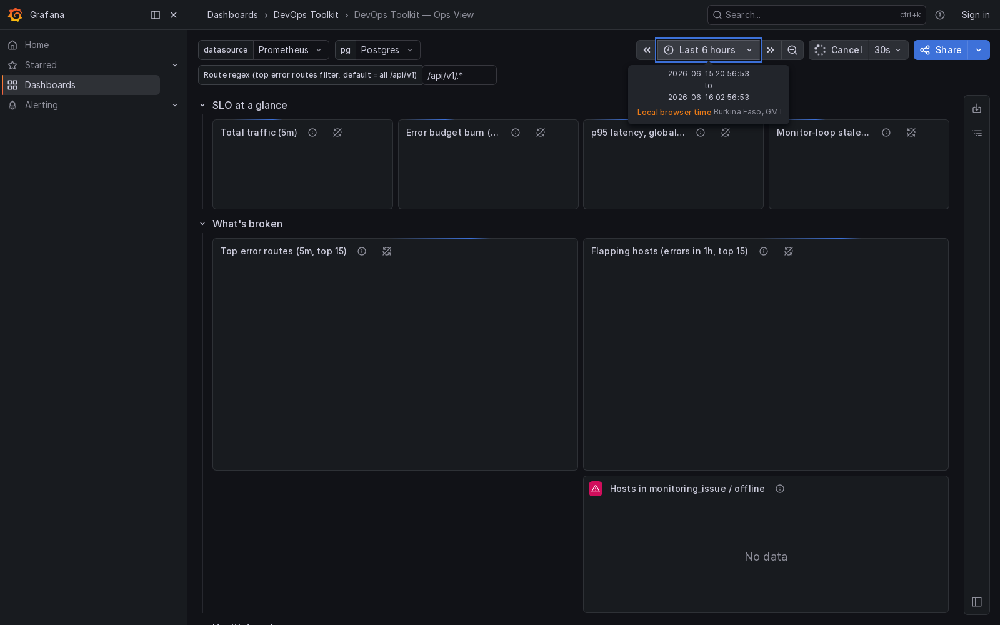
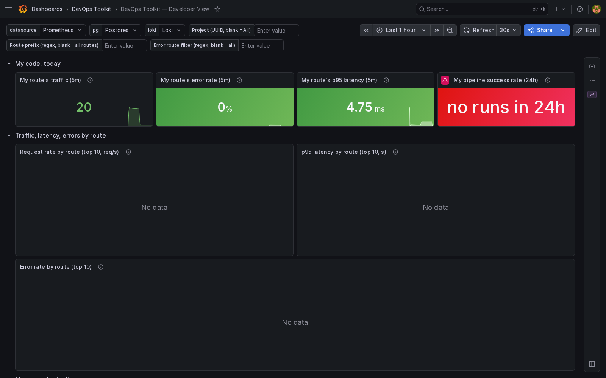
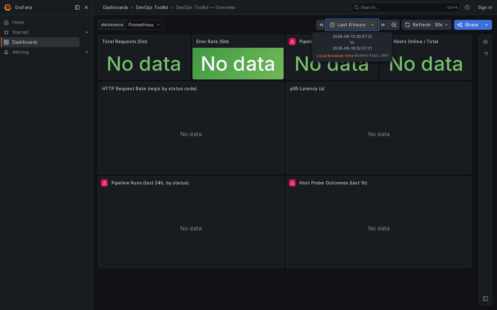
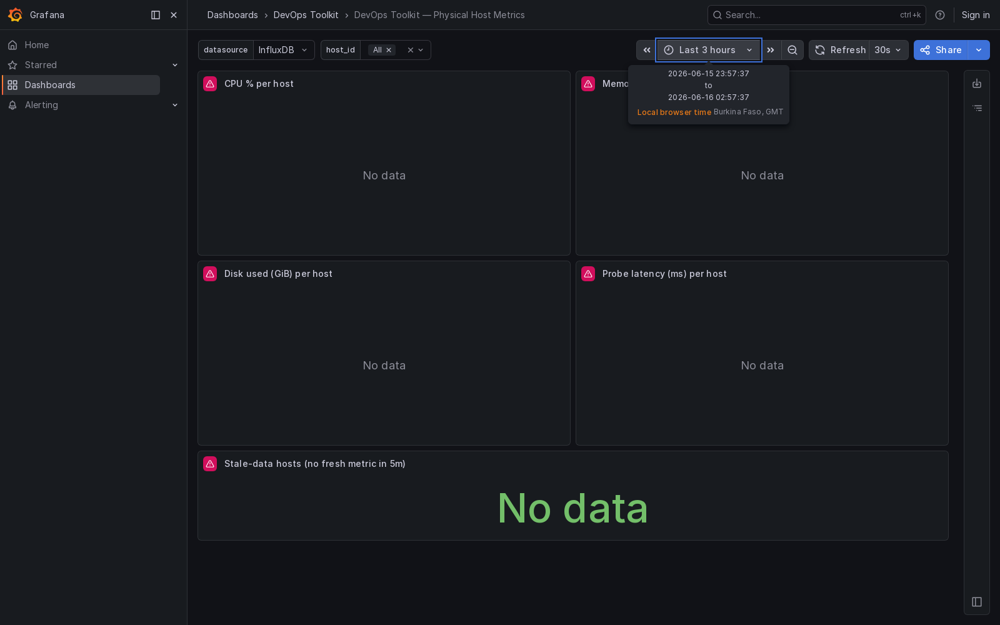

# DevOps Toolkit

Internal platform: CI/CD pipelines, multi-cluster Kubernetes, physical hosts,
service catalog with on-call + runbooks, and Prometheus observability —
all in one Go binary + React SPA.

[](#)
[](#)
[](#)
[](LICENSE)
[](VERSION)

> Languages: [English](README.md) · [简体中文](README.zh.md) — see [docs/i18n/SPEC.md](docs/i18n/SPEC.md)
> for how the project handles translations of both docs and the UI.

## Quick start

```bash
bash scripts/dev-env-up.sh
```

That's it. The script brings up 7 docker services, deploys an 8-node
containerlab network, generates an SSH keypair for the prober, and
registers every host as a `device` + `physical_hosts` row. Then prints
the access URLs.

Access after the script completes:

| Service | URL | Credentials |
|---|---|---|
| Backend API | http://localhost:3000 | header `X-User: alice` (dev_bypass) |
| Frontend | http://localhost:5173 | — |
| Grafana | http://localhost:3001 | `admin` / `admin` |
| Prometheus | http://localhost:9090 | — |

Tear down: `bash scripts/dev-env-down.sh`.

Without the full stack (just the binary, SQLite, no extra services):

```bash
go build -o devops-toolkit ./cmd/devops-toolkit
./devops-toolkit      # listens on :3000, SQLite at tests/fixtures/db/dev.db
```

## What's in the box

33 Go packages, ~25,700 lines. Backend in `internal/`, frontend in
`frontend/src/`, deploy in `deploy/`. Tests in the same dir as the
code they test — no separate `tests/` project.

| Module | Path | What it does |
|---|---|---|
| Pipeline | `internal/pipeline` | Blue-green / canary / rolling strategies, run history, phase tracking |
| K8s | `internal/k8s` | In-memory kubeconfig, multi-cluster registry, real `client-go` |
| K8s logs | `internal/k8s/logstream` | WS + SSE + one-shot pod log endpoints |
| Physical host | `internal/physicalhost` | State machine, SSH monitor loop, InfluxDB writer |
| Service catalog | `internal/servicecatalog` | Microservices, on-call, runbook, health rollup |
| Project | `internal/project` | Business line → system → project hierarchy |
| Audit | `internal/audit` | Every mutating action across 8 modules |
| Auth | `internal/auth` | LDAP + JWT + RBAC matrix + dev_bypass |
| Middleware | `internal/middleware` | CORS → Recovery → Tracing → Metrics → Auth → RBAC chain |
| Observability | `internal/observability` | Prometheus exporter + OpenTelemetry tracing |
| Frontend | `frontend/src/` | React 18 + Vite + Zustand, 14 pages, dark ops theme |

Each module has its own README sections under `docs/` if you need
deeper context. Start with [DOCUMENT_INDEX.md](DOCUMENT_INDEX.md).

## Dashboards

7 dashboards in `deploy/grafana/dashboards/`, auto-loaded by
Grafana on boot. Two role-based entry points plus five per-domain
drill-downs:

### Ops view — for the on-call operator

[](docs/screenshots/ops-view.png)

SLO row (traffic / error budget / p95 / monitor-loop staleness) →
"What's broken" tables (top error routes, flapping hosts) → health
trends (tick rate, 2xx/4xx/5xx stacked, pipeline failure rate) → alert
state (services degraded, stuck-running pipelines, hosts offline %).

### Developer view — for the engineer shipping a feature

[](docs/screenshots/developer-view.png)

Set `my_route` template var (e.g. `/api/v1/pipelines`) and `project`
to your project UUID. The top stats filter to your work, the
per-route top-10 charts stay global, the "My project's pipelines"
row is scoped to your UUID, and the live error stream surfaces
`level="error"` lines from the backend.

### Overview — system health at a glance

[](docs/screenshots/overview.png)

Original entry point — HTTP traffic, p95 latency, error rate,
pipeline outcomes. Good for the team standup screen.

### Physical host metrics — per-host time series

[](docs/screenshots/physical-host-metrics.png)

Per-host CPU / memory / disk from InfluxDB, plus stale-host detection
from Postgres. (The dev compose doesn't include InfluxDB so this
panel shows the layout but no data — wire up InfluxDB in production
to fill it.)

## Auth & RBAC quirks

A few things that trip up new contributors. All of them are
intentional and have file:line citations:

- **Auth bypass in dev:** `X-User: alice` header → fake `RoleOperator`
  user, no JWT needed. The handler at `internal/auth/middleware.go:137`
  short-circuits when `LDAP.dev_bypass=true`. `scripts/seed-data.sh`
  used to be missing this header (401 on every POST); the bug is
  fixed, but if you write your own client, set the header.
- **Per-project access:** the role matrix says yes, but the
  `requireMembership` middleware says no if the user isn't in
  the project. Even `RoleSuperAdmin` (if you invent one) gets the
  project check. The bypass is `systemCtx` in the hostproject
  package.
- **Audit `actor_id` comes from the JWT subject**, never from the
  request body. This is a non-negotiable invariant — the audit
  trail's value depends on it. If you're tempted to take
  `actor_id` from `c.Query("actor_id")`, don't.
- **Route param names are load-bearing.** The k8s logstream
  handler at `internal/k8s/logstream/handler.go` uses `:clusterID`
  (not `:id`) to match the k8s handler's param name. Gin panics
  on param-name conflicts, so a refactor that "fixes" `:clusterID`
  to `:id` will break the server at startup.

## Development

```bash
# Tests
go test ./...                                 # 31 packages
go test -race ./...                           # race detector
cd frontend && npx vitest run                 # React components
npx tsc --noEmit                              # type check

# Regenerate i18n locales (CI doesn't run this — it's a developer tool)
# `keepRemoved: true` in i18next-parser.config.js ensures
# hand-translated content isn't wiped on every run.
cd frontend && npm run i18n:extract
```

Commit conventions:
- Module-level changes: `feat(physicalhost):` or `fix(pipeline):`
- Cross-cutting: `docs(readme):`, `chore(deps):`
- The `Co-Authored-By: Claude <noreply@anthropic.com>` trailer
  is expected on all commits authored with this tool. Don't strip it.

## Versioning

Semantic: `MAJOR.MINOR.PATCH.BUILD` (e.g. `0.5.1.0`). Bumps happen
on release commits, not per-merge. See [CHANGELOG.md](CHANGELOG.md)
for the diff between versions; see [VERSION](VERSION) for the
current value.

## Documentation

| Doc | When |
|---|---|
| [DOCUMENT_INDEX.md](DOCUMENT_INDEX.md) | Start here — the doc tree, reading order, authority map |
| [ARCHITECTURE.md](ARCHITECTURE.md) | System architecture, request flow, data flow |
| [openspec/specs/](openspec/specs/) | Formal tech specs (authoritative for what each module does) |
| [DESIGN.md](DESIGN.md) | Frontend design system |
| [DEPLOY.md](DEPLOY.md) | Production deployment guide |
| [docs/TEST-ENVIRONMENT.md](docs/TEST-ENVIRONMENT.md) | Bringing up the 8-node test environment |
| [docs/i18n/SPEC.md](docs/i18n/SPEC.md) | i18n spec (both doc and UI translation rules) |
| [TODOS.md](TODOS.md) | Open work items |
| [CHANGELOG.md](CHANGELOG.md) | Release history |
| [CONTRIBUTING.md](CONTRIBUTING.md) | — *not yet written* (see TODOS) |

## License

[MIT](LICENSE) — Copyright (c) 2024 DevOps Toolkit contributors
